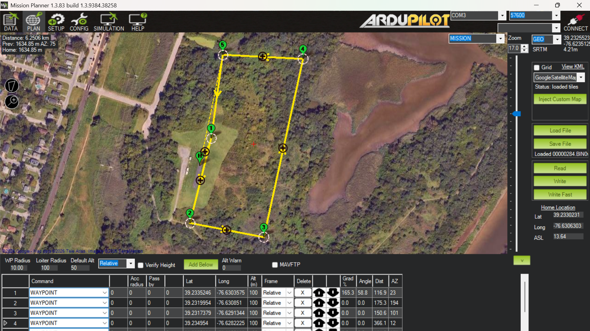
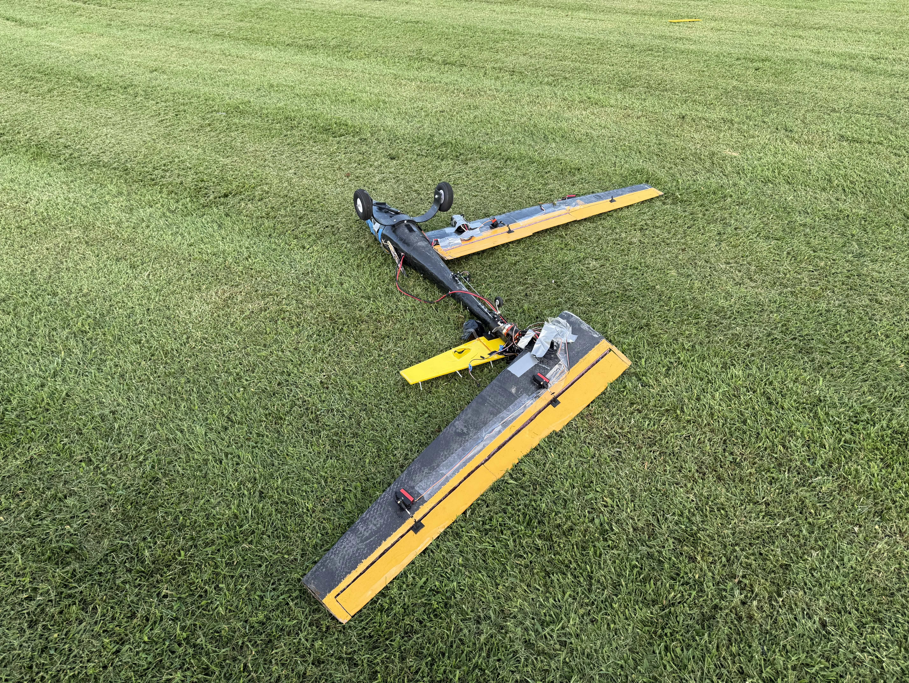
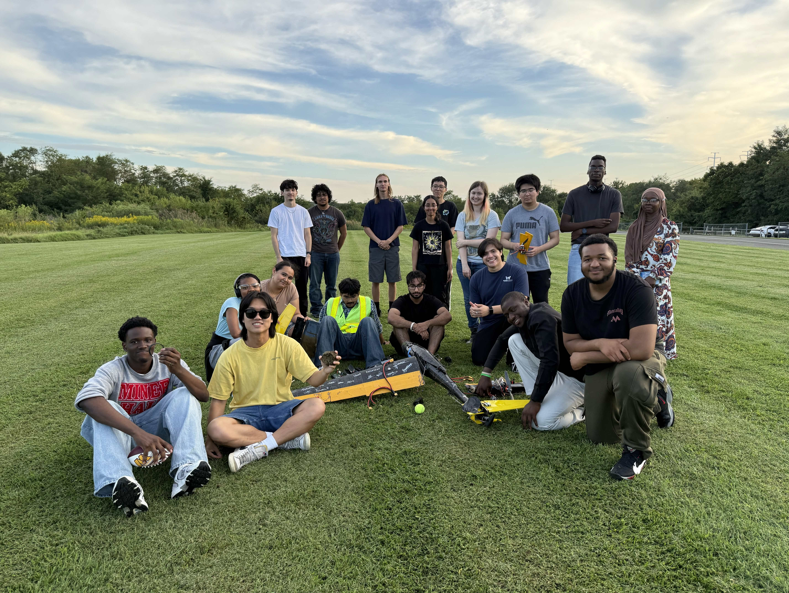
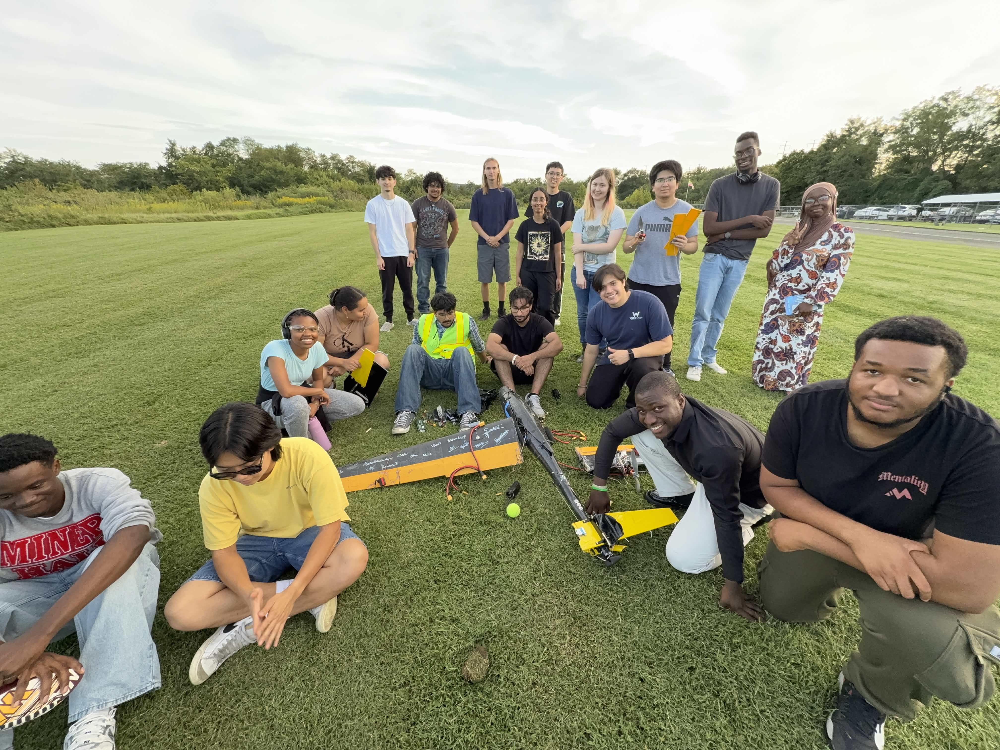

## 1. Media:

This section documents the relevant media to give context to the crash

## 1.1 Full Flight Footage:
<iframe
  width="100%"
  style="aspect-ratio: 16 / 9;"
  src="https://www.youtube-nocookie.com/embed/yfF0t_CwfbU?rel=0&modestbranding=1"
  title="Skypiea Final Crash"
  frameborder="0"
  allow="accelerometer; autoplay; clipboard-write; encrypted-media; gyroscope; picture-in-picture; web-share"
  allowfullscreen>
</iframe>

This is the full un-edited flight video.

---

## 1.2 Crash Footage:

<iframe
  width="100%"
  style="aspect-ratio: 16 / 9;"
  src="https://www.youtube-nocookie.com/embed/0jOpnR93ngI?rel=0&modestbranding=1"
  title="Skypiea Final Crash"
  frameborder="0"
  allow="accelerometer; autoplay; clipboard-write; encrypted-media; gyroscope; picture-in-picture; web-share"
  allowfullscreen>
</iframe>

This is the trimmed-down footage of just the crash (and the events leading up to it).

---

## 1.3 Flight Logs:

The flight logs were pulled directly from the on board SD card blackbox on the Skypiea flight controller. These logs can be analysed using any plotting software. The plotting software used in this analysis is the [Ardupilot UAV Logger](https://plot.ardupilot.org/#/). To test this yourself, simply drop the log .bin file into the plotter.

### 1.3.1 Useful resources:
1. [Crash Flight Log (Download Here)](/flight_logs/00000284.BIN)
2. [Ardupilot UAV Logger](https://plot.ardupilot.org/#/)

---
## 1.2 Flight Description

This is a brief description of the flight mission, and a reflection on the overall flight.

### 1.2.1 Mission Objective
The mission objective was to document and verify the endurance performance of the batteries that would have been used in the competition. Skypiea was loaded with 4 6s 4500mAh LiPo propulsion batteries and one 3s LiPo 2200mAh systems battery. The mission was a ~4 mile course.

The mission also served as a way for competition members to practice on-field assembly and mission demonstration. Since the propulsion batteries were switched from Li-ions to LiPo batteries, it was essential to collect endurance data before the competition. 

The 4 mile course was achieved by looping over a ~0.89 mile lap 5 times. The course represented 2 SUAS competition laps. The altitude of all the waypoints was set to a height of 100 meters.

### 1.2.2 Final Seconds and Crash
At the very beginning of the 3rd lap, the aircraft (in AUTO mode) banked to a very steep angle causing it to stall. This was unexpected since the aircraft demonstrated the same turn two times before, however, it is important to keep in mind that in-flight conditions are ever-changing. 

During the stall, the safety pilot adjusted the roll value to level out the flight, and then switches to FBWA. The flight was still in AUTO mode, which meant the pilot had FBWA privilages over the control surfaces ([ArduPilot: AUTO Mode – Stick Mixing](https://ardupilot.org/plane/docs/auto-mode.html)). After leveling out the flight, the pilot switched back to AUTO in the hopes of continuing the mission, however, the aircraft banked to an awkward angle again. This time, the pilot waited too long before taking over (as shown in the analysis). By the time the aircraft leveled out, it is too close to the ground and the right wing makes contact with the ground causing the crash.

### 1.2.3 Aftermath

The aircraft's right wing makes contact with the ground at a ground speed of about 25 meters per second causing a catastrophic crash as the aircraft spins on its yaw axis. This impact rips the right wing out of the fuselage along with a substantial amount of composite from the fuselage. The nose of the aircraft scoops up a chunk of dirt from the ground and the wooden tail is instantly shattered. The electronics and the batteries suffer no damage.

The crash was especially heartbreaking for the SUAS competition team since the development of the aircraft took time, energy and sacrifices from the members. The crash being the day before the competition travel date was also unfortunate. As a result, UMBC SUAS decided to not go to the competition and forfeit the mission demonstration points of the competition. (I am not editing/reading this section agian)

The team lead (Ben Bazarsuren) and the team lead intern (Sitora Chorshanbaeva) kept an optimistic approach to this calamity, and organized cleanup. Their level-headedness was commendable and allowed smooth operations after the crash. 

_We knew the world would not be the same. A few people laughed, a few people cried. Most people were silent._
(Im going to stop writing this section since this is turning more into a journal entry)

---
## 1.3 What Caused This?
In order to analyze and hopefully detect the point of failure, the most probable causes are listed and individually investigated by examining the logs collected from the flight.

The most probable causes of the crash are:
1. Absurd amount of roll requested by the autopilot.
2. Incorrect parameter settings
3. Skewed autotune data. Elevator not autotuned.
4. Delayed response from the safety pilot.

### 1.3.1 Analysis
Before we delve into the analysis of the each proposed failure, it is important to review the flight footage to contextualize ourselves. 

<iframe
  width="100%"
  style="aspect-ratio: 16 / 9;"
  src="https://www.youtube-nocookie.com/embed/LXIFc8nQMSU?rel=0&modestbranding=1"
  title="Skypiea Final Crash"
  frameborder="0"
  allow="accelerometer; autoplay; clipboard-write; encrypted-media; gyroscope; picture-in-picture; web-share"
  allowfullscreen>
</iframe>

The Green-ish box on the bottom left corner of the screen indicates the RC inputs to the aircraft. This helps identify when stick mixing during AUTO mode is active.

1. The YELLOW line represents the flight path in AUTO mode. After crossing the last waypoint of the third lap and targeting the first waypoint of the fourth lap, the aircraft banks hard
2. Pilot levels out the flight and (while in AUTO through stick mixing) and eventually switches to FBWA as represented by the ORANGE flight path.
3. The pilot switches back to AUTO to continue the mission, and the aircraft demonstrates the same extreme banking.
4. The pilot fully pitches up and switches to FBWA to level out the flight once again. This time however, the aircraft is too close to the ground.

## Detailed Event Analysis:

The flight log (`00000284.BIN`) and parameter file (`00000284_BIN.param`) were cross-referenced against the flight footage to establish an exact timeline. All timestamps below are seconds from log start (`t=0` at arm).

### Baseline: how the same turn behaved on laps 1 and 2

The mission was a 5-waypoint loop flown 3 times. The WP1→WP2 leg — the same turn that ultimately fails — was flown cleanly twice before the crash:

| Lap | Time window | Peak roll | Peak `DesRoll` (commanded) | Airspeed range |
|---|---|---|---|---|
| 1 | 71.9–81.3s | -57.8° | -59.7° | 19.0–23.2 m/s |
| 2 | 134.6–144.5s | -59.5° | -57.7° | 17.9–22.2 m/s |
| **3 (crash)** | **249.7–275.0s** | **-102.5° / +105.9°** | **-79.1°** | **14.8–29.1 m/s** |

On laps 1 and 2, the autopilot commands a consistent ~58–60° bank and the aircraft tracks it. On lap 3, the same maneuver escalates into two distinct, worsening loss-of-control events. This comparison is the clearest evidence in the log that something specific to lap 3 broke the pattern — it rules out "this maneuver is inherently unsafe" (it worked twice) and points instead at a lap-3-specific trigger compounded by a control architecture that could not contain it.

### Excursion 1 — t ≈ 249.9–260.1s

At **t=249.92s**, `DesRoll` snaps from -6.6° to **-61.2°** as AUTO begins the turn — consistent with the two prior laps. But this time the aircraft does not hold the turn; it overshoots to **-102.5° roll** and **-48.1° pitch (nose-down)** by t=253.4s. Airspeed and AOA confirm this is a genuine stall event, not just a steep bank: AOA reaches **15.4°** at t=252.8s and airspeed troughs at **14.85 m/s** (t=261.0s), against a minimum airspeed setting of `AIRSPEED_MIN=12 m/s`.

The pilot's remembered account — having control before switching to FBWA — is correct, but the parameter file shows why the aircraft's response to that control was not what would normally be expected. `STICK_MIXING = 0` (Disabled) in the parameter dump. Per ArduPilot's own documentation, this parameter is what allows pilot stick input to blend with and override the autopilot in AUTO mode — with it set to 0, that channel is closed.

This is confirmed directly in the log, not just inferred from the parameter. Between t=252.8s and t=259.9s, `RCIN` (pilot roll stick) swings through its full range — 988 to 1751 — while `RCOU` channel 6/7 (the actual aileron output) moves smoothly and independently, showing no correlation to the stick at all:

| Time | Pilot roll stick (RCIN) | Aileron output (RCOU) |
|---|---|---|
| 255.16s | 988 (full deflection) | 1533 |
| 255.48s | 988 (full deflection) | 1597 |
| 255.80s | 988 (full deflection) | 1637 |

The aileron output keeps changing on its own trajectory regardless of what the stick is doing. **The pilot's inputs during this AUTO-mode phase of excursion 1 had no effect on the control surfaces.** The roll recovery that does occur — `DesRoll` walking back from -63.7° to 0° between t=257.6s and t=260.1s — is the autopilot's own attitude controller recovering, not the pilot's stick mixing. The `MODE` log confirms AUTO→FBWA at **t=259.92s**; by that point roll had already reduced to -23.8°, meaning the pilot's manual authority only became active after the worst of excursion 1 had already resolved on its own.

Excursion 1 should be read as: **a stall/overshoot the autopilot itself pulled out of, with the pilot's stick inputs locked out of the loop the entire time by `STICK_MIXING=0`.**

### Excursion 2 — t ≈ 265.2–275.0s (fatal)

At **t=265.24s** the pilot switches back to AUTO to resume the mission. Within 0.3 seconds (**t=265.56s**), `DesRoll` again snaps to -49°, re-triggering the same turn logic. This time the outcome is worse, not a repeat:

| Metric | Excursion 1 peak | Excursion 2 peak |
|---|---|---|
| Roll | -102.5° | -83.0° / **+105.9°** (departure to the opposite side) |
| Pitch (nose-down) | -48.1° | **-73.6°** |
| AOA | 15.4° (brief spike) | **21.1°, sustained** over ~4s |

Because `STICK_MIXING=0` was still in effect, the pilot again had no control authority while in AUTO — this matches the pilot's recollection of holding the aircraft on heading before deliberately switching modes, since stick input alone could not have altered the flight path. The only way to regain authority was the mode switch itself, and the pilot took that action decisively: `RCIN` pitch is driven hard to 988 (full nose-up) starting at t=271.68s, and `MODE` confirms AUTO→FBWA at **t=271.82s** — this is the "fully pitches up and switches to FBWA" moment described from memory, and it is exactly where the log shows the correction beginning.

The problem is not reaction time — it is altitude and energy state at the moment control authority returned. At **t=271.82s**, when FBWA takes effect, the aircraft was already at **-56.6° roll and -70.5° pitch nose-down**, deep into a stall/spiral with airspeed rebuilding through a dive (climbing from 16.7 m/s at t=266s to 27+ m/s by t=273.9s). Unlike excursion 1, there was no autopilot recovery already in progress to meet the pilot halfway — every degree of correction had to come from FBWA control starting from that severely upset state. The aircraft never returns to level flight; the last valid attitude record (**t=274.96s**) shows roll at +105.9° and pitch at -45.6°, consistent with ground impact moments later at a ground speed of ~25 m/s (from `GPS.Spd`, t=275.0s).

### Cause 1: Absurd amount of roll requested by the autopilot — **Supported**

Both excursions exceeded the aircraft's own configured `ROLL_LIMIT_DEG = 80.0°` (roll reached 102.5° and 105.9°) and `PTCH_LIM_MAX_DEG/MIN_DEG = 33°/-35°` (pitch reached -48.1° and -73.6°). These are not close calls — they are 25–40° past the configured envelope. Laps 1 and 2 show the same waypoint turn is achievable within an ~58-60° bank; lap 3's commanded and achieved attitudes are a clear departure from that baseline. This cause is directly supported by the data.

### Cause 2: Incorrect parameter settings — **Supported**

`STICK_MIXING = 0` is the parameter with the most direct causal role identified in this log: it silently removed the pilot's ability to influence the aircraft while in AUTO, for both excursions, contrary to the default ArduPilot Plane behavior and contrary to what the flight plan implicitly assumed (the report's original description of "FBWA stick mixing privileges" in AUTO mode does not match this aircraft's actual configuration). This is a configuration decision, not a hardware or environmental factor, and it is independently verifiable in the parameter file and confirmed behaviorally in the RCIN/RCOU mismatch above.

### Cause 3: Skewed autotune data / elevator not autotuned — **Partially supported, needs qualification**

`AUTOTUNE_AXES = 3` (Roll + Pitch) indicates autotune was configured to cover both axes if run. The roll rate controller shows `RLL_RATE_P = RLL_RATE_I = 0.20395182` — identical to six decimal places. This is a strong signature of a gain that was never separately tuned (a completed autotune essentially never produces exactly equal P and I terms). The pitch rate controller, by contrast, shows `PTCH_RATE_P = 0.3636` and `PTCH_RATE_I = 0.5399` — these are distinct values, which does not support "elevator not autotuned" as stated; if anything, pitch shows more evidence of independent tuning than roll does. **This cause should be revised to focus on roll-axis rate gains specifically**, rather than the elevator/pitch axis. Whether these roll gains are default firmware values or a stale autotune result cannot be fully confirmed from the parameter file alone, but the P=I equality is a legitimate red flag worth stating plainly rather than treating as proven.

### Cause 4: Delayed response from the safety pilot — **Not supported as originally framed**

The log does not support pilot delay as a cause. During excursion 1, pilot stick input from t=252.8s onward had no effect on the aircraft because `STICK_MIXING=0` disabled it — there was no "response" to be delayed in a way that mattered until the mode switch itself. During excursion 2, the pilot's corrective action (hard nose-up input, mode switch to FBWA) began at t=271.68–271.82s, which is when the second upset was already visually and numerically severe (-56° roll, -70° pitch) — but this reflects how little time and altitude remained after AUTO re-engaged the turn at t=265.56s (roughly 6 seconds from re-trigger to intervention), not slowness in the pilot's decision-making. Given that stick input carried no authority in AUTO mode either way, mode-switch timing was the only lever available to the pilot, and it was used as soon as the upset became apparent. **This cause is not supported by the data and should be removed or reframed** as "insufficient time/altitude margin between AUTO re-engaging the turn and the aircraft entering an unrecoverable state" — a consequence of causes 1 and 2, not an independent pilot error.

---
## 1.4 Prevention
