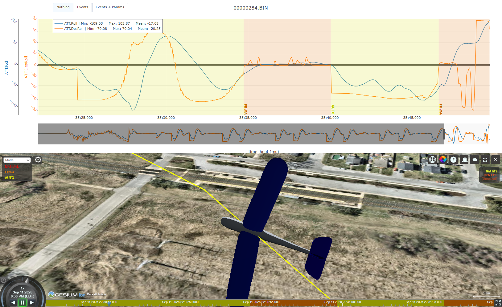
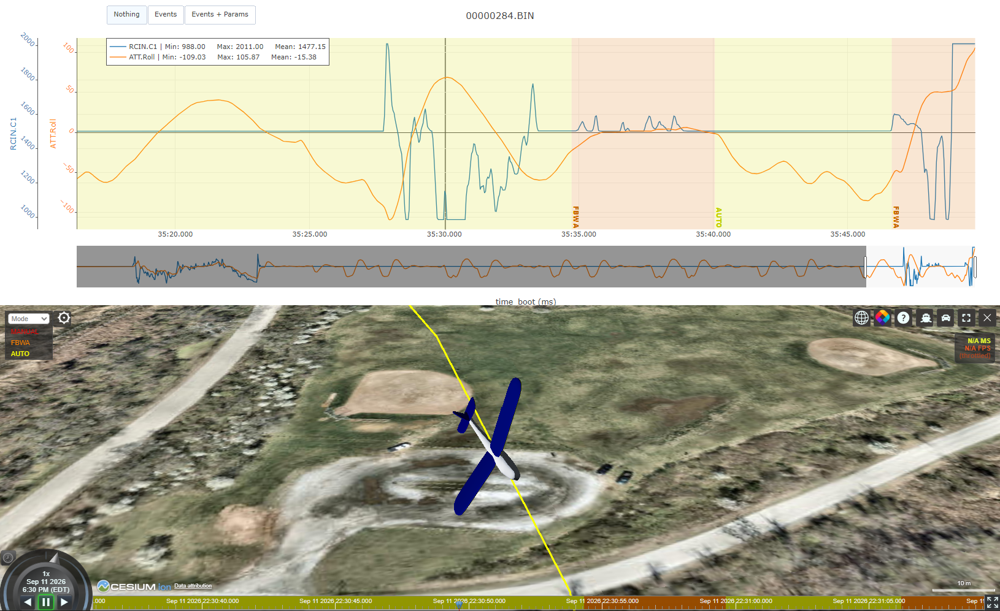
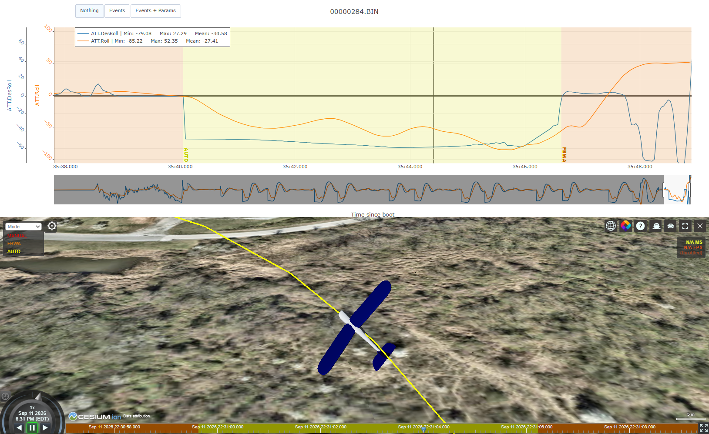
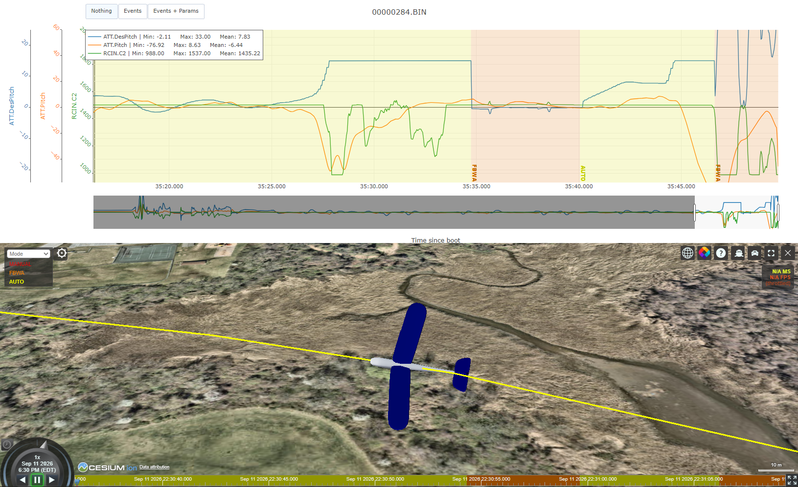

## 1. Media:

This section documents the relevant media to give context to the crash

### 1.1 Full Flight Footage:
<iframe
  width="100%"
  style="aspect-ratio: 16 / 9;"
  src="https://www.youtube-nocookie.com/embed/yfF0t_CwfbU?rel=0&modestbranding=1"
  title="Skypiea Final Crash"
  frameborder="0"
  allow="accelerometer; autoplay; clipboard-write; encrypted-media; gyroscope; picture-in-picture; web-share"
  allowfullscreen>
</iframe>

This is the full un-edited flight video.

---

### 1.2 Crash Footage:

<iframe
  width="100%"
  style="aspect-ratio: 16 / 9;"
  src="https://www.youtube-nocookie.com/embed/0jOpnR93ngI?rel=0&modestbranding=1"
  title="Skypiea Final Crash"
  frameborder="0"
  allow="accelerometer; autoplay; clipboard-write; encrypted-media; gyroscope; picture-in-picture; web-share"
  allowfullscreen>
</iframe>

This is the trimmed-down footage of just the crash (and the events leading up to it).

---

### 1.3 Flight Logs:

The flight logs were pulled directly from the on board SD card blackbox on the Skypiea flight controller. These logs can be analysed using any plotting software. The plotting software used in this analysis is the [Ardupilot UAV Logger](https://plot.ardupilot.org/#/). To test this yourself, simply drop the log .bin file into the plotter.

### 1.3.1 Useful resources:
1. [Crash Flight Log (Download Here)](/flight_logs/00000284.BIN)
2. [Skypiea Full Parameter List](/params/00000284.BIN.paaram)
3. [Ardupilot UAV Logger](https://plot.ardupilot.org/#/)

---
## 1.2 Flight Description

This is a brief description of the flight mission, and a reflection on the overall flight.

### 1.2.1 Mission Objective
The mission objective was to document and verify the endurance performance of the batteries that would have been used in the competition. Skypiea was loaded with 4 6s 4500mAh LiPo propulsion batteries and one 3s LiPo 2200mAh systems battery. The mission was a ~4 mile course.

The mission also served as a way for competition members to practice on-field assembly and mission demonstration. Since the propulsion batteries were switched from Li-ions to LiPo batteries, it was essential to collect endurance data before the competition. 

The 4 mile course was achieved by looping over a ~0.89 mile lap 5 times. The course represented 2 SUAS competition laps. The altitude of all the waypoints was set to a height of 100 meters.

### 1.2.2 Final Seconds and Crash
At the very beginning of the 3rd lap, the aircraft (in AUTO mode) banked to a very steep angle causing it to stall. This was unexpected since the aircraft demonstrated the same turn two times before, however, it is important to keep in mind that in-flight conditions are ever-changing. 

During the stall, the safety pilot adjusted the roll value to level out the flight, and then switches to FBWA. The flight was still in AUTO mode, which meant the pilot had FBWA privilages over the control surfaces ([ArduPilot: AUTO Mode – Stick Mixing](https://ardupilot.org/plane/docs/auto-mode.html)). After leveling out the flight, the pilot switched back to AUTO in the hopes of continuing the mission, however, the aircraft banked to an awkward angle again. This time, the pilot waited too long before taking over (as shown in the analysis). By the time the aircraft leveled out, it is too close to the ground and the right wing makes contact with the ground causing the crash.

### 1.2.3 Aftermath

The aircraft's right wing makes contact with the ground at a ground speed of about 25 meters per second causing a catastrophic crash as the aircraft spins on its yaw axis. This impact rips the right wing out of the fuselage along with a substantial amount of composite from the fuselage. The nose of the aircraft scoops up a chunk of dirt from the ground and the wooden tail is instantly shattered. The electronics and the batteries suffer no damage.

The crash was especially heartbreaking for the SUAS competition team since the development of the aircraft took time, energy and sacrifices from the members. The crash being the day before the competition travel date was also unfortunate. As a result, UMBC SUAS decided to not go to the competition and forfeit the mission demonstration points of the competition. (I am not editing/reading this section agian)

The team lead (Ben Bazarsuren) and the team lead intern (Sitora Chorshanbaeva) kept an optimistic approach to this calamity, and organized cleanup. Their level-headedness was commendable and allowed smooth operations after the crash. 

_We knew the world would not be the same. A few people laughed, a few people cried. Most people were silent._
(Im going to stop writing this section since this is turning more into a journal entry)

---
## 1.3 Probable Causes
In order to analyze and hopefully detect the point of failure, the most probable causes are listed and individually investigated by examining the logs collected from the flight.

The most probable causes of the crash are:
1. Unsafe roll limit configuration.
2. Reduced elevator authority following control horn replacement, uncorrected by re-autotuning.
3. Delayed safety pilot intervention during the second excursion, driven by hesitation to override the autopilot.

Each probable cause is heavily backed by the collected flight logs. The full analysis and proofs are documented in the following sections. 

### 1.3.1 Context
Before we delve into the analysis of the each proposed failure, it is important to review the flight footage to contextualize ourselves. 

<iframe
  width="100%"
  style="aspect-ratio: 16 / 9;"
  src="https://www.youtube-nocookie.com/embed/LXIFc8nQMSU?rel=0&modestbranding=1"
  title="Skypiea Final Crash"
  frameborder="0"
  allow="accelerometer; autoplay; clipboard-write; encrypted-media; gyroscope; picture-in-picture; web-share"
  allowfullscreen>
</iframe>

The Green-ish box on the bottom left corner of the screen indicates the RC inputs to the aircraft. This helps identify when stick mixing during AUTO mode is active.

1. **Excursion 1:** The YELLOW line represents the flight path in AUTO mode. After crossing the last waypoint of the third lap and targeting the first waypoint of the fourth lap, the aircraft banks hard
2. Pilot levels out the flight and (while in AUTO through stick mixing) and eventually switches to FBWA as represented by the ORANGE flight path.
3. **Excursion 2:** The pilot switches back to AUTO to continue the mission, and the aircraft demonstrates the same extreme banking.
4. The pilot fully pitches up and switches to FBWA to level out the flight once again. This time however, the aircraft is too close to the ground.

## 1.4 Detailed Event Analysis:

The flight log (`00000284.BIN`) and parameter file (`00000284_BIN.param`) were cross-referenced against the flight footage to establish an exact timeline. The parameter file contains all the pre-defined values that govern the autopilot behavior. All timestamps below are seconds from log start (`t=0` at arm).

### 1.4.1 Timestamps

| Lap | Time window | Peak roll | Peak `DesRoll` (commanded) | Pitch tracking error (mean / max) |
|---|---|---|---|---|
| 1 & 2 | 71.9–144.5s | -57.8° / -59.5° | -59.7° / -57.7° | 1.1° / 9.2° |
| 3 (crash) | 249.7–275.0s | -102.5° / +105.9° | -79.1° | 20.6–28.5° / up to 110° |

On laps 1 and 2, the commanded bank stayed within a consistent ~58–60°, well inside the aircraft's configured `ROLL_LIMIT_DEG = 80.0°`, and the aircraft tracked it closely. 

Lap 3 targets a similar turn, but the outcome is markedly different. This establishes that laps 1 and 2 succeeding was was a fluke of not yet having encountered conditions that exposed the unsafe roll limit and the weakened elevator.

### 1.4.2 Excursion 1: t ≈ 249.9–260.1s

#### 1.4.2.1 What happened:

- t=249.92s: DesRoll snaps to -61.2°. Bank angle is consistent with laps 1 & 2 (the autopilot's initial request was reasonable).
- t=253.4s: Aircraft overshoots to -102.5° roll (_really_ bad), 22.5° past the configured ROLL_LIMIT_DEG = 80.0°.
- Airspeed drops to 14.85 m/s (below AIRSPEED_MIN = 12 m/s floor).
- AOA spikes to 15.4°: confirms a genuine stall/overshoot, not a controlled steep turn.
- At 60° roll, aircraft requires 2G to hold altitutde. The IMU reports 1.7G.

_Desired Roll vs Cannonical Roll_

#### 1.4.2.2 Pilot correction:

- Achieved roll correlates strongly with pilot stick input at zero time lag (r = -0.70).
- Achieved roll correlates weakly with autopilot DesRoll, which lags 1.3s behind actual attitude — the autopilot was reacting to where the plane already was, not leading it back to level.
- Roll is walked back from -90°+ to -23.8° by manual correction before the mode switch.
- t=259.92s: MODE log confirms switch to FBWA, logged only after the pilot had already recovered the aircraft.

_RC roll input vs Cannonical Roll_

### 1.4.3 Excursion 2: t ≈ 265.2–275.0s (fatal)

#### 1.4.3.1 What happened:

- t=265.24s: Pilot returns aircraft to AUTO to resume mission.
- t=265.56s (0.3s later): DesRoll snaps to -49° to -58° (not unreasonable).
- Roll reaches -83.0°, then departs to +105.9° on the opposite side (both past the 80° limit).
- Pitch drives to -74.5° nose-down at t=272.1s.

#### 1.4.3.2 Pilot intervention:

- Pilot's account: waited to see if the autopilot would self-correct.
- t=271.68–271.82s: Full nose-up input and switch to FBWA (per RCIN and MODE).
- t=274.96s: Last valid attitude record: roll +105.9°, pitch -45.6°. Ground impact follows at ~25 m/s.

Bottom line: With degraded elevator authority, there wasn't enough altitude left to recover once intervention came.

## 1.5 Cause Summary

These are the most probable causes of the crash. Each assertion is strongly supported by the reflection performed on the UAV's log. The casues were first shortlisted and then analysed.

### 1.5.1 Cause 1: Unsafe roll limit configuration

- `ROLL_LIMIT_DEG = 80.0` let the autopilot chase bank angles the airframe couldn't hold.
- Both excursions overshot it by ~25° (102.5° and 105.9°).
- Laps 1–2 never tested this limit (stayed in a 58–60° band). The successful turns were pure luck.
- Common root cause behind both excursions.

### 1.5.2 Cause 2: Reduced elevator authority (control horn replacement, no re-autotune)

- Pitch tracking error: 20.6° (excursion 1) and 28.5° (excursion 2, 110° peak).
- Autopilot commanded +15 
- PTCH_RATE_P/I gains reflect the pre-repair elevator response; autotune was never re-run post-repair.
- Compounds Cause 1: even without the roll overshoot, weakened pitch authority limited recovery.

### 1.5.3 Cause 3: Delayed pilot intervention in excursion 2

- It was not a reaction time failure. A reasonable inference from excursion 1's outcome.
- Pilot waited too long before takeover on excusion 2.
- Cost: intervention at t=271.68s came with roll/pitch already far more extreme than excursion 1's intervention point.
- Downstream effect of Causes 1 & 2 (not an independent pilot error).

---
## 1.4 Prevention
1. Testing parameters on a trainer prototype.
2. Having lead-ins to corner turns.