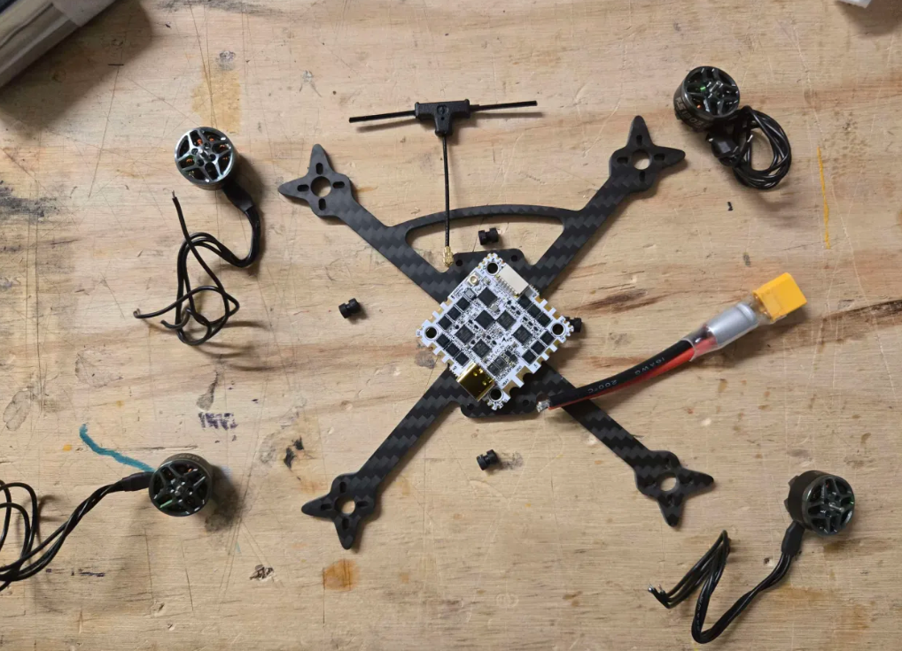
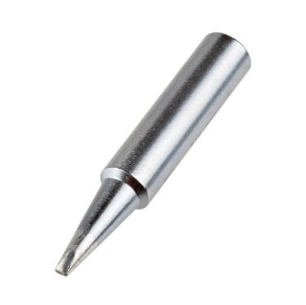
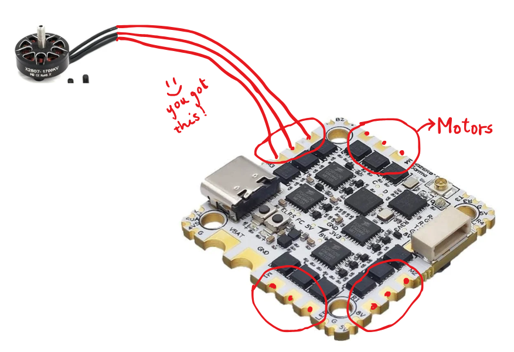
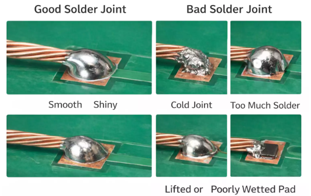
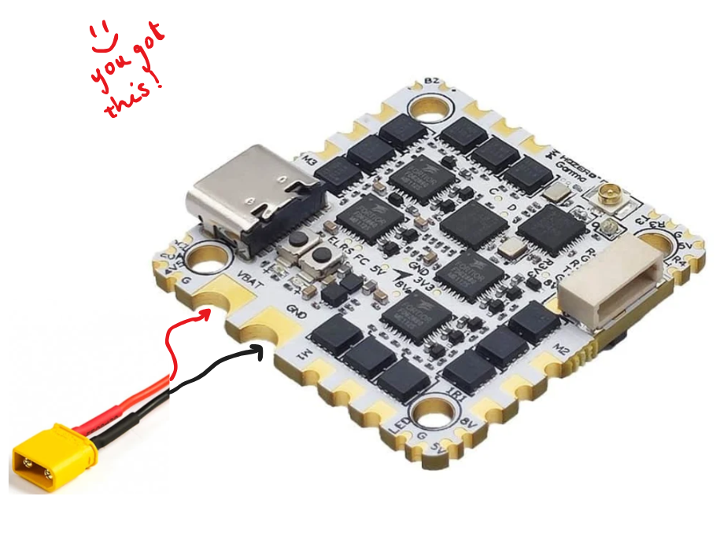
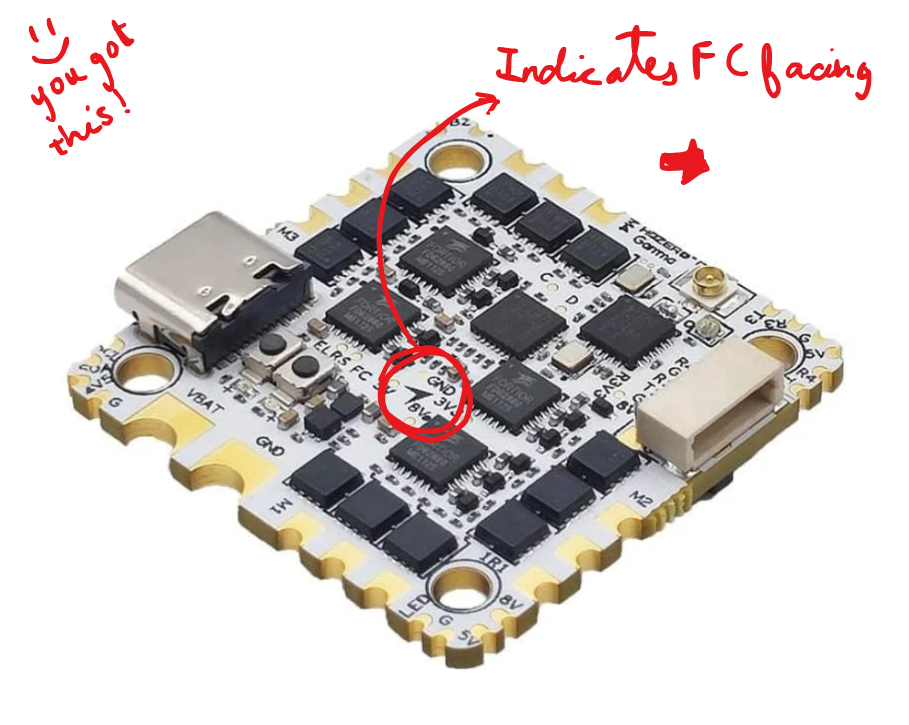
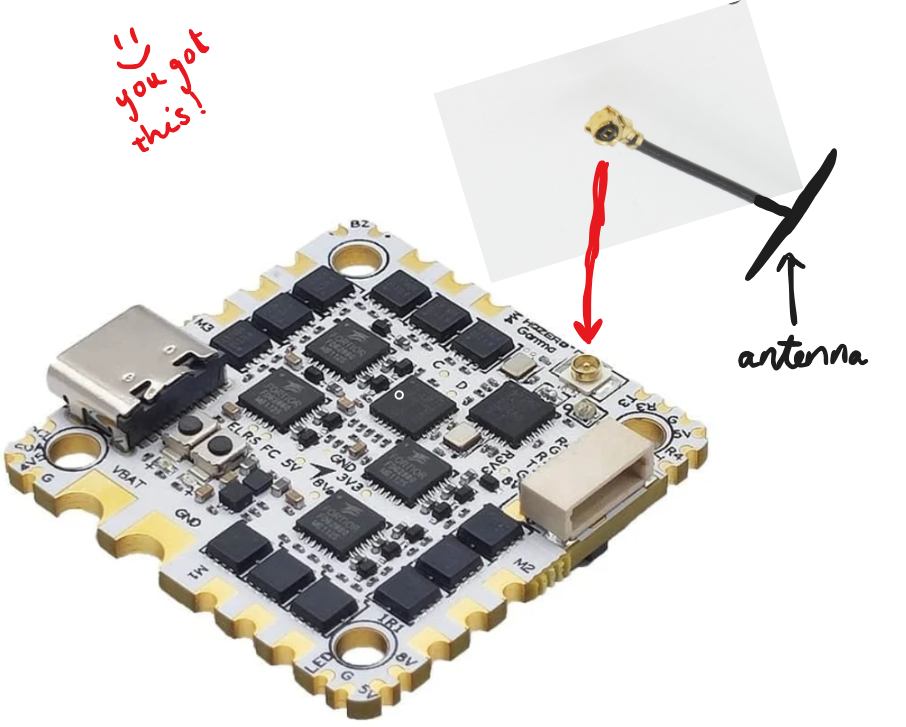
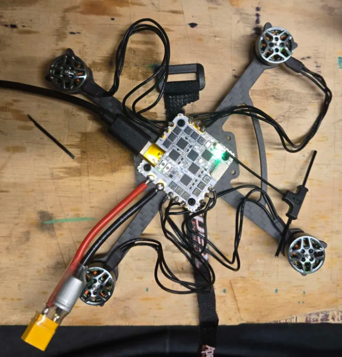

## Equipment:
1. Drone frame
2. Drone Flight controller ([HDZero Gamma AIO – G473 FC + 45A AM32 ESC + ELRS RX](https://docs.hd-zero.com/gamma-introduction))
3. 4 motors
4. 4 propellers
5. Battery: 11.1V, 3s, 850mAh
6. Soldering Iron
7. Solder
8. XT30 connetor
9. Antenna

## Step 1: Download Betaflight

Search up this software called "Betaflight".

ORRRR Use the web interface: https://app.betaflight.com/

Keep this. it will be useful later.

## Step 2: Charge the Batteries:

Make sure they are charging/ charged

## Step 3: Basic drone setup:

The assembled drone should look something like the picture. You sill have four motors on each arm, a flight controller in the middle, the antenna connected to the flight controller and everything screwed in.

## Step 4: Take the Motors out!

Open the motor boxes! A good idea would be to assign one person to each motor. Please don't lose the motors or the screws :))

Each box has:
1. One motor
2. 10 screws

Keep only the motor out. Don't lose the screws.

## Step 5: Soldering Time!

Each motor needs to be connected onto the flight controller. We do this by *Soldering*.

### Soldering steps:

1. Plug in the soldering iron. 
2. Ensure the soldering iron has a chisel tip

3. Keep the heat to about 700 Fahrenheit
4. Add some solder to the tip of the soldering iron.
5. Add some solder to the pad you are soldering to.

6. Solder the XT30 connector to the flight controller. POLARITY MATTERS!!!!

## Step 6: VELCRO STRAP PLEASE

Find a velcro strap and put it on the drone frame.

## Step 7: Assembly

1. Screw on the flight controller to the frame. Make sure that the arrow is facing forward on the frame.

2. Use the rubber spacers provided in the flight controller's box to provide cushioning between the frame and the board.
3. Screw on the motors to the frame.
4. Add the antenna to the FC. It just clicks on!

Here is the fully assembled drone:

## Step 8: Programming time

### Binding the Receiver
  To bind the receiver, you need to:
  1. Keep the receiver powered until the LED flashed GREEN.
  2. Go to the Wifi settings on your phone/laptop, connect to `ExpressLRS RX`. The password is `expresslrs`.
  3. Go to `10.0.0.1` on the browser.
  4. Enter the same Bind Phrase set on your transmitter.
  5. Reboot.  

  Set the transmitter to model STD.
  The receiver should be bound with the transmitter now.

## Step 9: Throttle test

## Step 10: Flying time