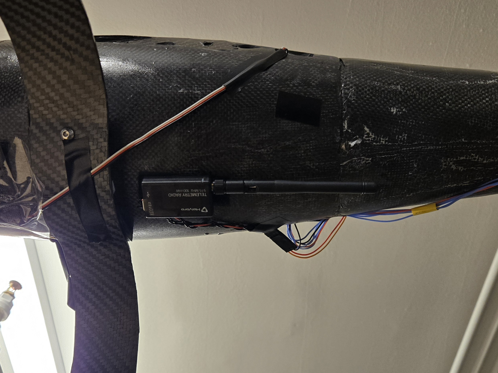

The telemetry radio is what allows communication between the UAV and the Ground Control Station (GCS). Skypiea is equipped with a [100mW 915Hz Holybro Sik Telemetry Radio](https://holybro.com/products/sik-telemetry-radio-v3?variant=41562952302781). This radio allows plug-and-play usage where either radio can be on the UAV and connected to GCS laptop. It is also fairly inexpensive for its performance.

The telemetry radio is mounted on the belly of the aircraft since that positioning provides a direct line line of sight during flights, which is good for the range. The range of this radio out of the box is not great and has caused many drop-outs during flights. To mitigate this, the Antenna tracker was constructed that effectivly resolved this caveat. [Find the documentation on the antenna tracker here]().

## Ardupilot Setup

On ardupilot, set the following parameters:

| Parameter    | Value |
| ------------ | ----- |
| `SERIALX_PROTOCOL` | 2 |
| `SERIALX_BAUD` | 57600 |