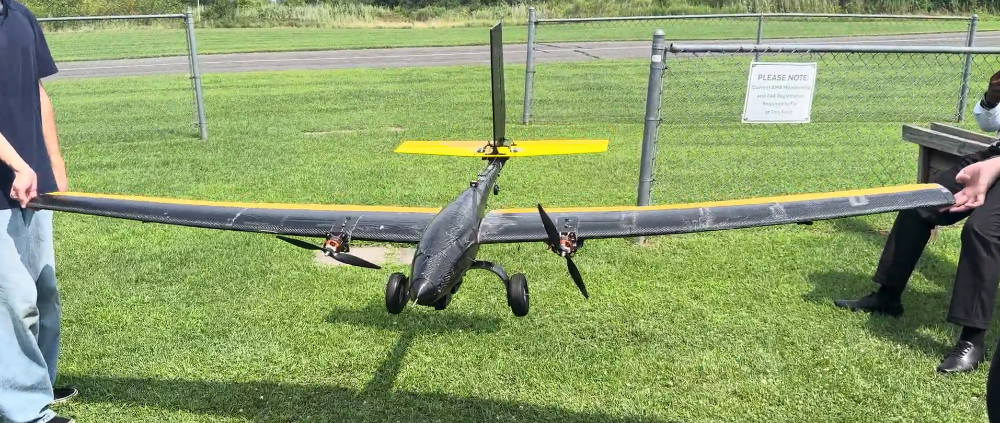
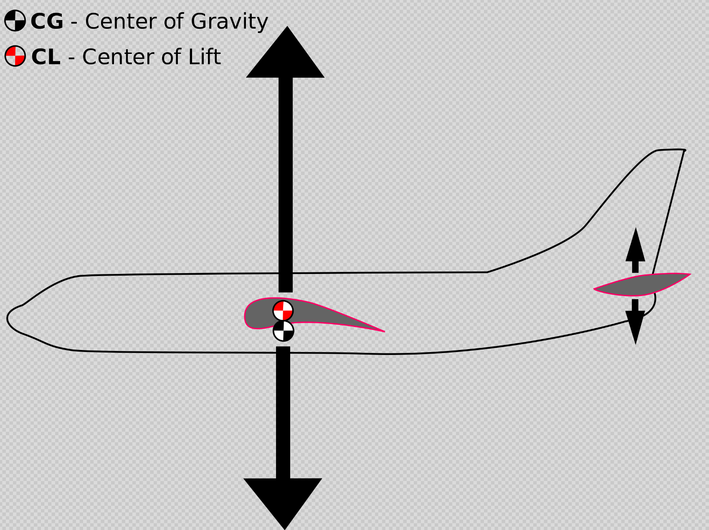

Before every flight, a mandatory Center of Gravity Test is performed. This is to ensure that the aircraft is not nose heavy or tail heavy.

Center of gravity will henceforth be reffered to as "CG".

## The CG Test

The CG test is a simple balance check. Support the aircraft under both wings at the quarter-chord line (a point one quarter of the way back from the leading edge to the trailing edge) with one fingertip on each side, and let it hang free.

Read how it settles:

- **Balances level, or with a slight nose-down attitude**: CG is at or just ahead of the reference point. This is what we want.
- **Tips nose-down hard**: nose heavy. CG is too far forward.
- **Tips tail-down**: tail heavy. CG is behind the reference point. Stop and re-balance before flying.

The test is really measuring where the aircraft's CG (its center of mass) sits relative to the wing. Holding at the quarter-chord is just a convenient way of asking *"is the CG at, or ahead of, the wing's aerodynamic center?"*. The next section explains why that point is the one we care about.

*Center of gravity test being performed*

## Why is this necessary?
In our organization, an interesting motto has been passed down from generations. It goes:

*"A nose heavy plane flies once. A tail heavy plane never flies"*

The reason why a plane's center of gravity matters so much is due to its impact on the aircraft's stability, control response and overall flight safety. The relative position of the CG with respect to the [Center of Lift](#center-of-lift) can produce massive (but predictable) differences in flight performance. 

## Center of Lift

The center of lift (abbreviated COL or CoL) is the point where the sum total of all lift generated by parts — principally by wings, control surfaces, and aerodynamic fuselage parts — balances out and the aggregate direction their force will act on a craft while in an atmosphere ([Source](https://wiki.kerbalspaceprogram.com/wiki/Center_of_lift)).

## Aerodynamic Center

The [center of lift](#center-of-lift) (also called the center of pressure) is not a fixed point. It moves along the chord as the angle of attack changes. A point that wanders around is a poor reference for setting balance.

The *aerodynamic center (AC)* solves this. It's defined as the point about which the wing's pitching moment stays constant regardless of angle of attack. Because it doesn't move with AoA, it's a stable, predictable anchor for the wing's pitch behavior. For a typical subsonic airfoil the AC sits at roughly *25% of the chord* back from the leading edge.

So when we balance at the quarter-chord line, we're referencing the aerodynamic center, not the (moving) center of lift. The quarter-chord point in the diagram above is really the AC.

## Why the Quarter-Chord Position for Skypiea

For a complete aircraft (wing plus tail) the truly correct stability reference is not the wing's aerodynamic center but the *neutral point*. The neutral point is the AC of the whole aircraft, and it sits *behind* the wing's AC because the horizontal tail generates its own lift and pushes the effective balance point aft.

The rule for stability is straightforward:

> If the CG is **ahead of** the neutral point, the aircraft is statically stable. If it's behind, it's unstable.

The distance between the CG and the neutral point, expressed as a fraction of the chord, is called the **static margin**. A small positive static margin gives us a plane that's stable but still responsive — which ties directly back to the motto:

> *"A nose heavy plane flies once. A tail heavy plane never flies."*

A tail-heavy plane has its CG behind the neutral point (negative static margin) and is uncontrollable — hence *never flies*.

For Skypiea we balance at the **wing's quarter-chord** as a practical rule of thumb because:

1. The quarter-chord is easy to find and mark on the physical airframe — no calculation needed at the field.
2. The wing's AC always sits *ahead* of the full-aircraft neutral point, so balancing here guarantees a **positive static margin** with margin to spare.
3. It reliably lands us in the "slightly nose-heavy" regime, which is stable and forgiving — exactly where we want a model to be for repeatable, safe flights.

In other words, the quarter-chord test is a conservative shortcut: it doesn't compute the exact neutral point, but it keeps Skypiea's CG comfortably on the safe side of it every single time.

The three main cases of the center of gravity's position are:

### 1. Forward CG:
  When the CG is forward with respect to the center of lift. Forward CG makes the plane nose heavy. This increases the aircraft's pitch stability at a cost of high tail down force requirements. While increasing stability sounds good and even works in favour for gliders in some cases, too much makes the controls feel sluggish. 

  Aircrafts with forward CGs require larger take-off distances and higher angle of attack to produce enough force to lift the heavy nose. The higher lift requirement also increases stall speeds.
