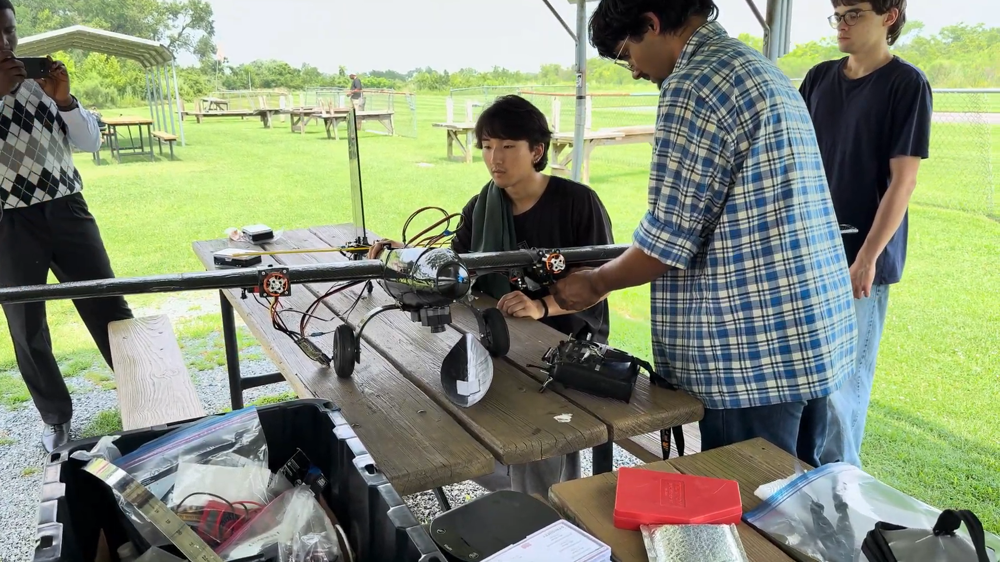

Safety is our number one priority. Before every flight, we go through a carefully crafted safety checklist made by the contribution of the entire team. The goal of this checklist is to do a top-to-bottom inspection of all main components of the aircraft.

An assigned safety officer is responsible to narrate and go through the checklist and verifying all criterias are being met. This keeps our flights safe from crashes and increases morale of the ground crew and pilot.

Follwing is the full safety checklist:

<iframe src="/pdfs/safety_checklist.pdf" width="100%" height="800px" style="border: none; display: block; min-height: 600px;"></iframe>

