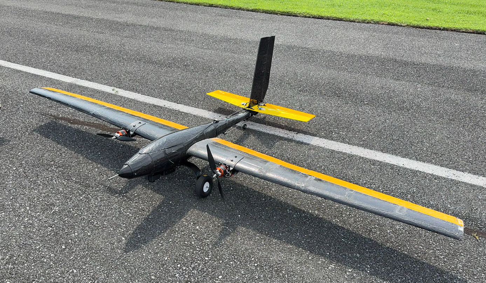

**Skypiea** is a Student Unmanned Aerial Vehicle (SUAS) platform equipped with advanced avionics and autonomous flight capabilities. This documentation provides comprehensive setup instructions for configuring and deploying Skypiea from initial hardware assembly through flight-ready state.

Skypiea uses the lovely free and open-sourced Ardupilot software. Thanks to the devs keeping this project up and running!!!

## Purpose

This guide covers the essential steps required to bring Skypiea to operational readiness, including:

- **Hardware Integration**: Flight controller setup and peripheral configuration
- **System Parameters**: Critical flight parameters and tuning
- **Geofencing**: Safety boundaries and restricted areas
- **Pre-Flight Verification**: System checks before deployment

## Avionics

Follow these sections in order to properly configure Skypiea, then reference the additional parameter pages as needed:

1. [Hardware Setup](/vehicles/skypiea/avionics/hardware-setup) — wiring and serial port configuration
2. [Flight Controller](/vehicles/skypiea/avionics/flight-controller) — hardware selection and rationale
3. [Airspeed Sensor](/vehicles/skypiea/avionics/airspeed-sensor) — airspeed sensor parameters
4. [Rangefinder](/vehicles/skypiea/avionics/rangefinder) — lidar altimeter parameters
5. [GPS](/vehicles/skypiea/avionics/gps) — GPS setup
6. [Radio Control](/vehicles/skypiea/avionics/rc) — RC receiver setup
7. [Telemetry Radio](/vehicles/skypiea/avionics/telemetry) — telemetry radio setup

## Manufacturing

Build steps for each structural component:

1. [Fuselage](/vehicles/skypiea/manufacturing/fuselage)
2. [Wing](/vehicles/skypiea/manufacturing/wing)
3. [Tail](/vehicles/skypiea/manufacturing/tail)
4. [Landing Gear](/vehicles/skypiea/manufacturing/landing_gear)
5. [Ground Steering](/vehicles/skypiea/manufacturing/ground_steering)

## Flight Safety

Checks and safety systems to verify before flight:

1. [Safety Checklist](/vehicles/skypiea/flight-safety/safety_checklist) — pre-flight verification steps
2. [Arming Switch](/vehicles/skypiea/flight-safety/arming_switch) — radio arming switch configuration
3. [Center of Gravity](/vehicles/skypiea/flight-safety/center_of_gravity) — why CG matters on a fixed wing

Each section is self-contained but builds upon the previous configuration steps. Ensure all hardware is properly connected before proceeding to parameter configuration.
